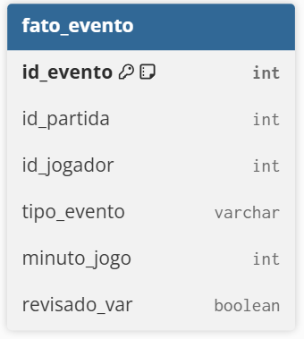
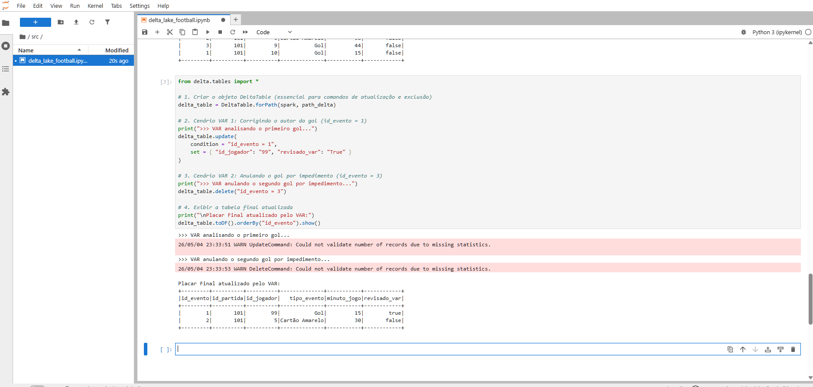
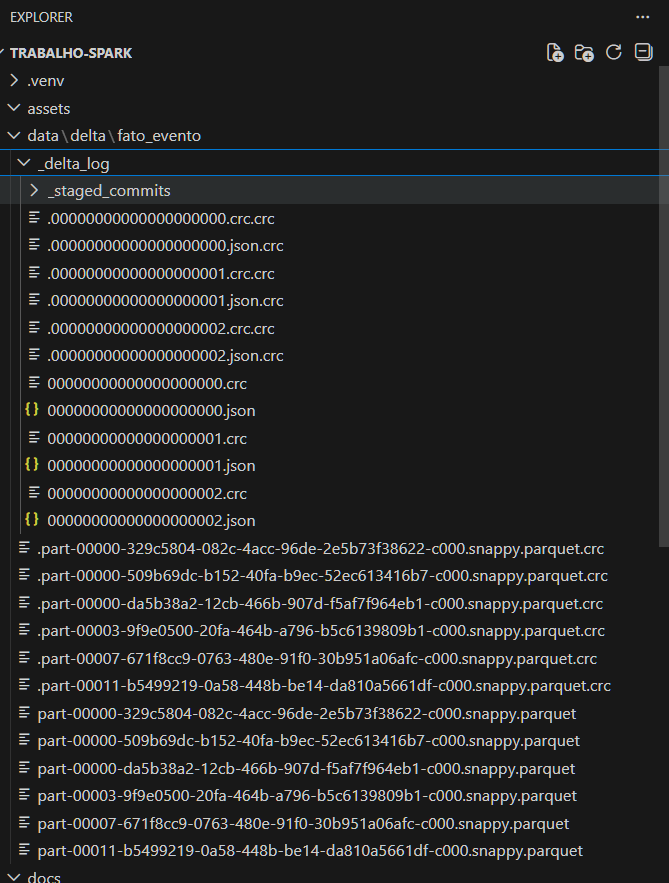

# Delta Lake

## O que é o Delta Lake?

O **Delta Lake** é uma camada de armazenamento de código aberto (open-source) que traz confiabilidade e performance para os _Data Lakes_. Criado originalmente pela Databricks, ele foi desenhado para funcionar perfeitamente com o Apache Spark.

Assim como o Apache Iceberg, o Delta Lake resolve o problema da "falta de regras" nos Data Lakes tradicionais. Em um lago de dados comum, se um processo de gravação falhar na metade, você acaba com arquivos corrompidos ou dados duplicados. O Delta Lake encapsula os arquivos de dados (geralmente no formato Parquet) com um **log de transações** detalhado, garantindo que o ambiente se comporte com a segurança de um banco de dados relacional.

## Principais Funcionalidades

O formato Delta traz recursos essenciais para a Engenharia de Dados moderna:

- **Transações ACID:** Assim como o Iceberg, o Delta garante que múltiplas operações de leitura e escrita ocorram simultaneamente de forma segura. Se o trabalho falhar, a transação sofre _rollback_ (é desfeita) e a tabela permanece intacta.
- **Unificação de Batch e Streaming:** O Delta permite que você leia e grave dados na mesma tabela de forma contínua (em tempo real) ou em grandes lotes diários, sem precisar de arquiteturas separadas.
- **Viagem no Tempo (Time Travel):** O log de transações mantém um histórico das versões dos dados. É possível restaurar a tabela para uma versão anterior ou consultar os dados exatamente como estavam há uma semana.
- **Schema Enforcement e Evolution:** O Delta bloqueia automaticamente a inserção de dados que não correspondam à estrutura da tabela (Enforcement), mas permite a evolução controlada do schema quando novas colunas precisam ser adicionadas (Evolution).

## Aplicação no nosso Cenário (Futebol e VAR)

O Delta Lake se encaixa perfeitamente na dinâmica de atualização dos dados esportivos.

Imagine que estamos processando os eventos de uma partida do Flamengo em tempo real. Um gol é registrado na tabela `fato_evento`. Minutos depois, o Árbitro de Vídeo (VAR) revisa o lance e anula o gol por impedimento.

Utilizando PySpark com Delta Lake, o engenheiro de dados pode disparar um comando `DELETE` ou `UPDATE` especificamente para aquele evento. O log de transações do Delta registrará a exclusão de forma atômica. Quem estiver consultando o painel de estatísticas durante a correção não verá dados pela metade ou erros; a atualização acontecerá de forma transparente, garantindo a integridade do modelo analítico.

## 🛠️ Implementação Prática e Operações CRUD

Para demonstrar o cenário descrito acima na prática, utilizamos a API do PySpark com a biblioteca `delta.tables` no nosso arquivo `delta_lake_football.ipynb`.

### 1. Modelo de Dados (Tabela fato_evento)

Abaixo, o diagrama da nossa tabela que registra os lances do jogo:



### 2. Inserção Inicial (Create/Insert)

O Delta Lake garante que, mesmo em fluxos de alta velocidade, cada registro seja gravado de forma atômica na pasta `data/delta/`.

```python
# Dados iniciais da partida
novos_eventos = [
    (1, 101, 10, 'Gol', 15, False),
    (2, 101, 5, 'Cartão Amarelo', 30, False),
    (3, 101, 9, 'Gol', 44, False)
]

# Criando o DataFrame e salvando no formato Delta
df = spark.createDataFrame(novos_eventos, schema)
df.write.format("delta").mode("overwrite").save("../data/delta/fato_evento")
```

### 3. Atualização (Update) - A Correção do VAR

O VAR identificou que o primeiro gol não foi do jogador 10, mas sim do jogador 99. Utilizamos a API do Delta para realizar a correção cirúrgica baseada na condição do ID do evento.

```python
from delta.tables import DeltaTable

# Carrega a tabela Delta mapeando o diretório de arquivos
deltaTable = DeltaTable.forPath(spark, "../data/delta/fato_evento")

# Realiza o UPDATE
deltaTable.update(
    condition = "id_evento = 1",
    set = { "id_jogador": "99", "revisado_var": "true" }
)
```

### 4. Exclusão (Delete) - Gol Anulado

Simulamos a anulação do segundo gol da partida por impedimento do jogador 9 (evento de ID 3).

```python
# Realiza o DELETE com base na condição
deltaTable.delete("id_evento = 3")
```

### 5. Evidência de Execução (O VAR em Ação)

Abaixo, a saída real do nosso ambiente Jupyter comprovando as operações de `UPDATE` e `DELETE`. Note que o evento 3 (anulado) foi removido e o jogador do evento 1 foi atualizado com sucesso.



### 6. Por baixo dos panos (Arquitetura Delta)

A verdadeira mágica do Delta Lake acontece na pasta `_delta_log`. A imagem abaixo do nosso explorador de arquivos mostra os logs de transação `.json` gerados para cada operação CRUD (o `INSERT`, o `UPDATE` e o `DELETE`), provando que os dados não são sobrescritos cegamente, mas sim versionados de forma segura (Transações ACID).



> **Nota Técnica:** Diferente de reescrever todo o arquivo Parquet, essas operações alteram os metadados na pasta secreta `_delta_log`. Isso mantém o histórico de versões intacto, sendo a essência das propriedades ACID em um Data Lake.
