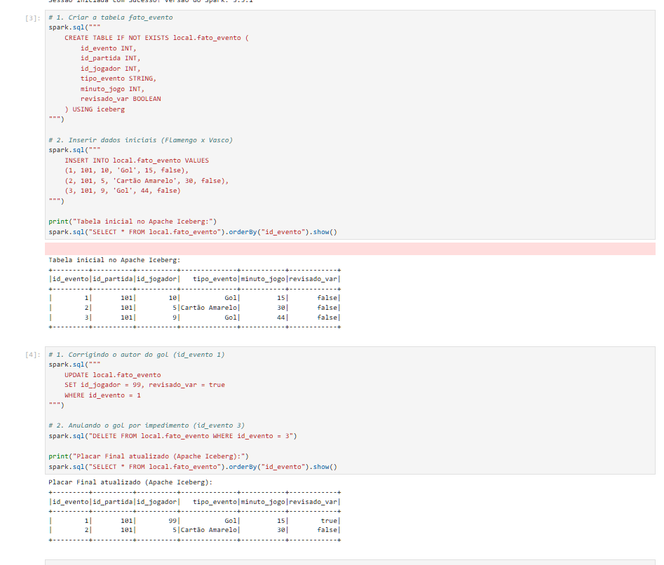
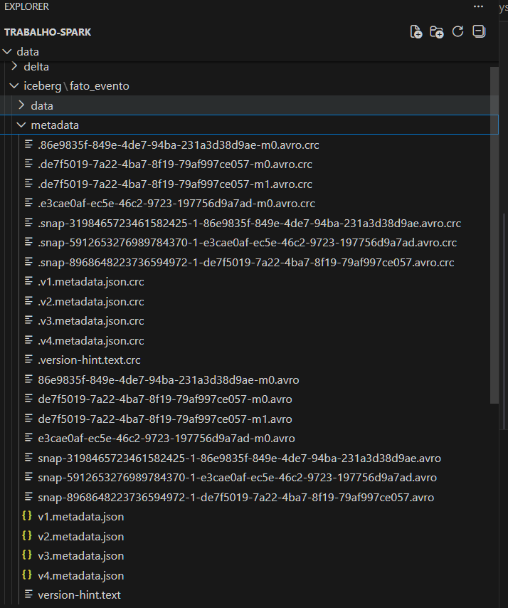

# Apache Iceberg

## O que é o Apache Iceberg?

O **Apache Iceberg** é um formato de tabela aberto e de alto desempenho para conjuntos de dados analíticos enormes. Ele não é um motor de processamento (como o Spark) e nem um sistema de armazenamento físico (como o HDFS ou o AWS S3). Em vez disso, ele é uma **camada de metadados** que fica entre o processamento e o armazenamento.

Historicamente, os _Data Lakes_ baseados no ecossistema Hadoop (usando o formato Hive) tinham muitas limitações ao lidar com tabelas gigantes. Atualizar uma única linha ou alterar a estrutura (schema) da tabela era um processo demorado e perigoso, podendo corromper os dados. O Iceberg foi criado originalmente pela Netflix justamente para resolver esses problemas, trazendo a confiabilidade dos bancos de dados tradicionais (SQL) para o mundo do Big Data.

## Principais Funcionalidades

O Iceberg introduz conceitos fundamentais para a nossa arquitetura:

- **Transações ACID:** Garante que operações de leitura e escrita sejam seguras. Se um trabalho de inserção de dados falhar no meio do caminho, a tabela não ficará corrompida com dados parciais.
- **Evolução de Schema (Schema Evolution):** Permite adicionar, renomear ou remover colunas de uma tabela sem a necessidade de reescrever todos os dados antigos.
- **Particionamento Oculto (Hidden Partitioning):** O Iceberg gerencia as partições fisicamente debaixo dos panos, evitando que o usuário precise escrever consultas SQL complexas para filtrar dados de forma eficiente.
- **Viagem no Tempo (Time Travel):** Como o Iceberg rastreia todas as mudanças através de "snapshots" (fotografias do estado da tabela), é possível consultar como a tabela estava exatamente em um dia ou horário anterior.

## Aplicação no nosso Cenário (Futebol e VAR)

No contexto do nosso modelo de estatísticas de partidas de futebol, o Apache Iceberg brilha nas operações críticas.

Se o Árbitro de Vídeo (VAR) anula um gol após a partida já ter encerrado, nós precisamos executar um comando de `DELETE` ou `UPDATE` na tabela `fato_evento`. Em um _Data Lake_ sem Iceberg, teríamos que reescrever todo o arquivo daquela rodada. Com o Iceberg operando em conjunto com o Apache Spark, podemos rodar um simples comando DML (Data Manipulation Language) e a camada de metadados do Iceberg se encarregará de invalidar o registro do gol antigo de forma atômica e segura, sem interromper as análises de quem estiver lendo a tabela naquele exato momento.

## 🛠️ Implementação Prática e Operações CRUD

No nosso arquivo `iceberg_football.ipynb`, utilizamos as extensões do Apache Iceberg no Spark para executar comandos DML (Data Manipulation Language) utilizando a linguagem SQL padrão.

### 1. Definição da Tabela (DDL)

Abaixo, o diagrama da nossa tabela que registra os lances do jogo:


A criação da tabela no Iceberg é feita de forma declarativa, definindo claramente o schema e indicando o uso do formato `iceberg`.

```sql
CREATE TABLE IF NOT EXISTS local.fato_evento (
    id_evento INT,
    id_partida INT,
    id_jogador INT,
    tipo_evento STRING,
    minuto_jogo INT,
    revisado_var BOOLEAN
) USING iceberg
```

### 2. Inserção (Create/Insert)

A inserção de dados cria um novo arquivo de manifesto, garantindo que a versão inicial da partida (Flamengo x Vasco) seja registrada com segurança.

```sql
INSERT INTO local.fato_evento VALUES
(1, 101, 10, 'Gol', 15, false),
(2, 101, 5, 'Cartão Amarelo', 30, false),
(3, 101, 9, 'Gol', 44, false)
```

### 3. Atualização (Update) - A Correção do VAR

O VAR validou o lance e identificou que o autor do primeiro gol foi, na verdade, o jogador de ID 99. Utilizamos o comando `UPDATE` tradicional de bancos de dados.

```sql
UPDATE local.fato_evento
SET id_jogador = 99, revisado_var = true
WHERE id_evento = 1
```

### 4. Exclusão (Delete) - Gol Anulado

Para remover o segundo gol que foi anulado por impedimento, o comando `DELETE` é suportado nativamente, sem necessidade de reescrever a tabela inteira.

```sql
DELETE FROM local.fato_evento WHERE id_evento = 3
```

### 5. Evidência de Execução (Spark SQL)

Abaixo, a comprovação do nosso código rodando no Jupyter Notebook. Através da linguagem SQL padrão, conseguimos criar a tabela, inserir os dados iniciais e simular a ação do VAR atualizando (UPDATE) o autor do primeiro gol e anulando (DELETE) o segundo gol.



### 6. Por baixo dos panos (Arquitetura Iceberg)

Ao contrário de arquiteturas antigas que dependem de pastas físicas, o Apache Iceberg gerencia tudo através de metadados. A imagem abaixo mostra a pasta `metadata` criada no nosso projeto. Note a presença dos arquivos `.json` (v1, v2, v3, v4) e `.avro`. Cada operação DML que executamos via SQL gerou um novo "snapshot" (foto do estado atual), garantindo que consultas em andamento nunca falhem e permitindo auditoria dos dados.



> **Nota Técnica:** Cada uma dessas operações CRUD gerou um novo arquivo JSON na subpasta `metadata` do Iceberg, formando o histórico de snapshots. Isso demonstra a capacidade do formato de suportar modificações atômicas de nível de linha (row-level updates) utilizando diretamente o Spark SQL.
