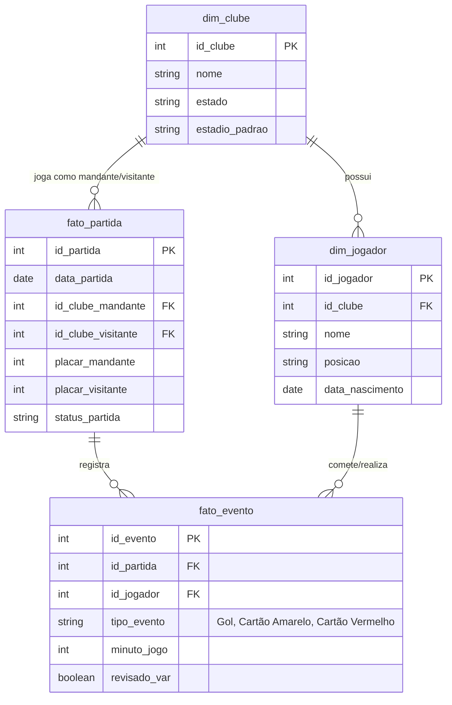

# Contextualização e Cenário

## O Problema de Negócio

O ecossistema de análise de dados no esporte, especificamente no futebol de alto rendimento, gera um volume massivo de eventos a cada partida. O desafio arquitetural é manter um _Data Lake_ atualizado com dados de jogadores, clubes e eventos de partidas (gols, cartões, substituições), garantindo a confiabilidade das estatísticas.

Em um _Data Lake_ tradicional, operações de atualização e exclusão são complexas e custosas. No entanto, no cenário do futebol moderno, o uso do Árbitro de Vídeo (VAR) e auditorias pós-jogo frequentemente exigem a correção de dados históricos, como:

- **INSERT**: Inserção de novos eventos em tempo real ou em lotes ao fim de uma rodada.
- **UPDATE**: Correção da autoria de um gol ou atualização do status de um jogador transferido.
- **DELETE**: Anulação de um gol ou reversão de um cartão vermelho após revisão do VAR.

Para solucionar este problema, este projeto implementa e compara as tecnologias **Delta Lake** e **Apache Iceberg**, que trazem transações ACID para o Data Lake.

---

## Fonte de Dados

A fonte primária de dados simulada para este ambiente baseia-se em extratos públicos no formato CSV inspirados em bases estatísticas do **Kaggle** (como o _Campeonato Brasileiro de Futebol Dataset_).

Os arquivos crus (`.csv`) são ingeridos e processados pelo **Apache Spark**, transformados em um modelo relacional e salvos nos formatos colunares avançados (Iceberg e Delta) na camada _Silver/Gold_ da nossa arquitetura.

---

## Modelo Entidade-Relacionamento (ER)

Para estruturar as análises, foi definido um modelo _Star Schema_ contemplando as dimensões de Clubes e Jogadores, e tabelas fato para as Partidas e os Eventos que ocorrem dentro delas.

